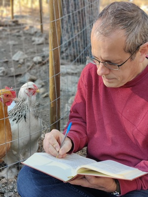

My wife and I have been in full-time Christian ministry with [The Navigators](https://www.navigators.org) since our college days--over twenty years now. For a while, we had another child born in each city we moved to. Just doing our part at being fruitful and multiplying. But you knew that couldn't go on forever. We ended up with five wonderful kids.

After a number of years on the mission field in Japan, my wife and I sensed God leading us to the States so I could go to seminary. With God's help, I completed a Master of Arts in Biblical and Theological Studies at [Phoenix Seminary](https://www.ps.edu). It's a great seminary. You should go.

The main reason I went to seminary was to gain proficiency in the Biblical languages of Hebrew and Greek. I have a solid start now, but am continuing to learn both languages through the Biblical Language Center. I wish every Christian would invest some time in learning one or both of these languages. Personally, I have found tremendous joy in being able to read some portions of God's Words just as they were originally written by Moses or the Apostle John. Not only that, but I also feel much less intimidated by "well, scholar so-and-so says that verse means..." I am gaining tools to be able to evaluate claims about what the Bible says. It is definitely an ongoing journey, but one I find richly rewarding. If you are at all interested in the languages, you should check out the [Biblical Language Center](https://www.biblicallanguagecenter.com) because their approach to teaching the languages is enjoyable and doable for anyone.

I made this blog as a way to share what I am learning from the Lord as I study and reflect on Scripture. I pray that some of what I write would encourage you in seeking to know Jesus Christ as your Savior and Lord. 

---

